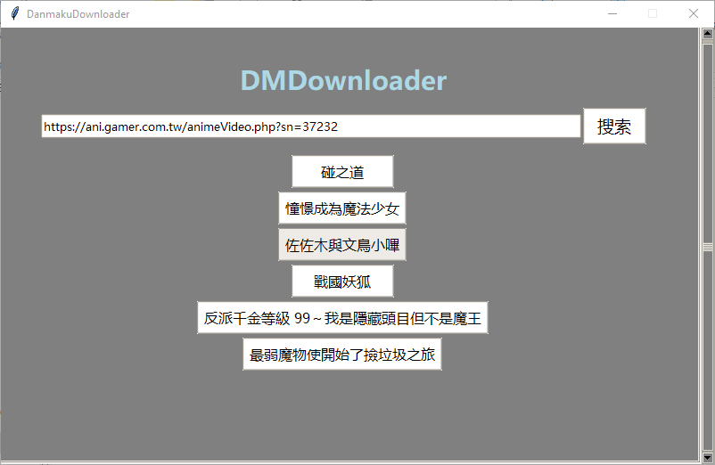
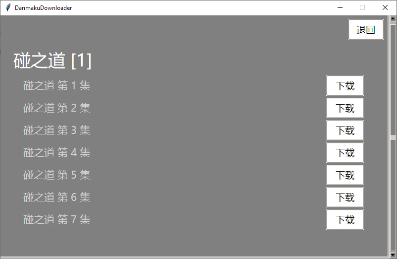
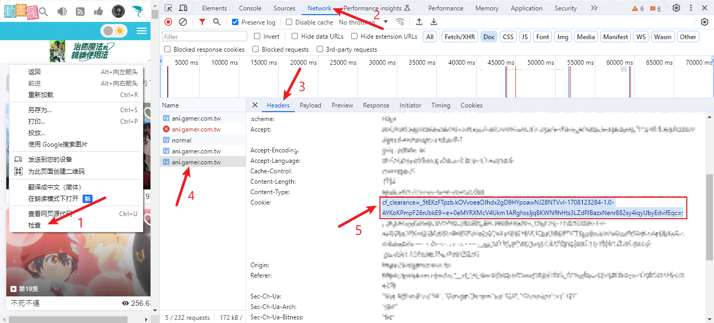
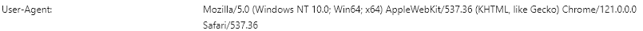
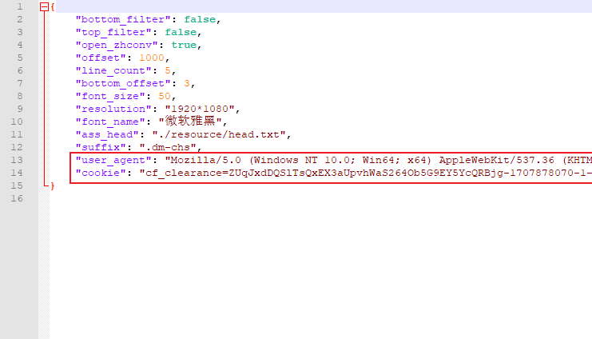

# DMDownloader

<!-- TODO：分页 -->

<!--BiliBili及-->

巴哈姆特動畫瘋番剧弹幕下载。

内置弹幕转 ass 字幕工具。以便视频播放器加载。

<!--也可以选择直接下载弹幕源文件交给其他转换工具转换（暂未实现）-->

主界面



下载界面




## 下载安装

使用 Python3 编写。依赖了 Requests 和 zhconv。

Python 安装：
- [安装Python - 廖雪峰的官方网站](https://www.liaoxuefeng.com/wiki/1016959663602400/1016959856222624)
- [Python3 环境搭建 | 菜鸟教程](https://www.runoob.com/python3/python3-install.html)
- 安装即可，不需要配置环境变量。

Requests 安装方式，必须安装：
1. 打开 Python 安装目录下的`Scripts`文件夹。
2. 打开 cmd 执行，`pip install requests`

zhconv 安装方式。如果不需要可以不安装，但要将`config.json`中的`open_zhconv`设为`false`：
1. 打开 Python 安装目录下的`Scripts`文件夹。
2. 打开 cmd 执行，`pip install zhconv`

依赖安装完成后，双击运行`dmDownloader.pyw`即可。

## 注意

### 巴哈姆特弹幕获取

由于巴哈姆特動畫瘋的弹幕api需要进行人机验证，所以下载其弹幕时需要设置`config.json`中的`user-agent`及`cookie`。

#### 设置方式

打开巴哈姆特動畫瘋网页，打开开发者工具(f12或左键检查)。

在`Network` -> `Headers`找到`User-Agent`和 cookie 中的`cf_clearance`。





并配置到`config.json`中。见下图：



注：cookie过期时间大约为3个小时，过期后就要全部重新设置。


## 配置

配置文件为`resource/config.json`。

<!--TODO：开个新文件做详细说明-->

默认配置：
```
{ 
    "bottom_filter": false, // 是否开启底部弹幕过滤。
    "top_filter": false,  // 顶部弹幕过滤。
    "open_zhconv": true,  // 是否开启繁转简。
    "offset": 1000,  // 偏移上限
    "line_count": 5, // 行数限制
    "bottom_offset": 3, // 底部偏移，单位为行。
    "font_size": 50, // 字体大小
    "resolution": "1920*1080", // 分辨率，不需要跟视频实际分辨率一致，播放器会执行缩放。
    "font_name": "微软雅黑", // 字体名称
    "ass_head": "./resource/head.txt", // ass头文件的模板
    "suffix": ".dm-chs", // 弹幕文件后缀，最终弹幕文件名将为{弹幕名称}{后缀}.ass
    "cookie": "", // 巴哈姆特所需
    "user_agent": "" // 同上
}
```

收藏栏文件：`resource/favorites.json`，其内容将被加载到主界面上，以便快速访问。

格式为:
```
{
    "名称1": "网址1",
    "名称2": "网址2",
    ...
}
```


## 感谢

弹幕转换及命令行判断参考了 [muzuiget/niconvert](https://github.com/muzuiget/niconvert)

使用 [gumblex/zhconv](https://github.com/gumblex/zhconv) 模块进行繁转简

TK异步任务管理使用了[燕十七编写的工具类](https://www.cnblogs.com/libitum/p/14848615.html)
